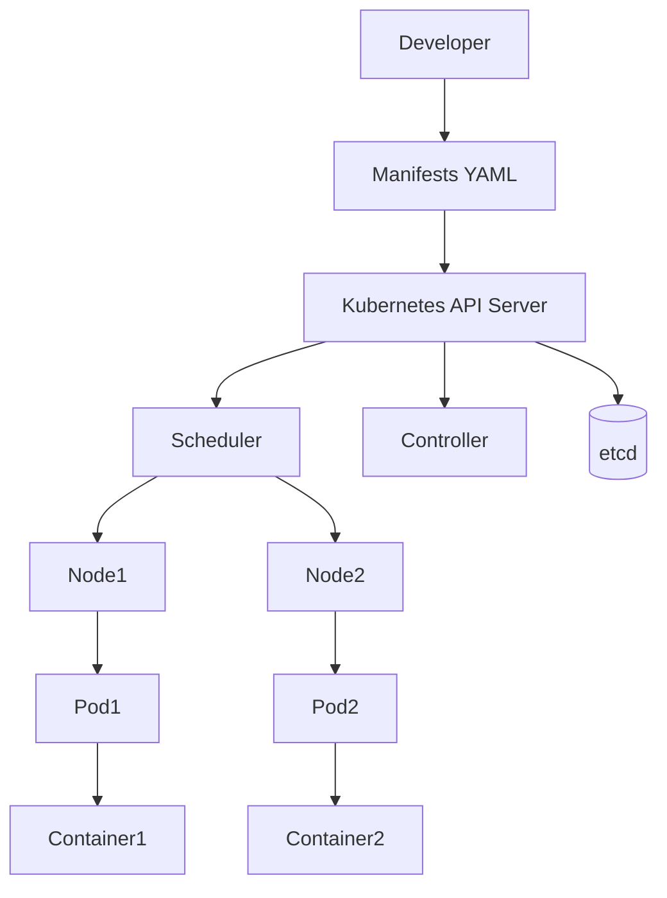

# 001-principes.md
# Kubernetes — Principes

---

## Historique

- 2013 — Google développe Borg (orchestration interne de containers à grande échelle)
- 2014 — Annonce publique de Kubernetes par Google
- 2015 — Kubernetes 1.0 et intégration à la CNCF
- 2016 — Adoption massive avec Docker
- 2017 — Kubernetes devient le standard cloud‑native
- 2018 — Support officiel AWS (EKS), Azure (AKS), GCP (GKE)
- 2019 — Montée du GitOps (ArgoCD, Flux)
- 2020 — Kubernetes devient le runtime standard des microservices
- 2021 — Adoption généralisée en entreprise (banque, industrie)
- 2023 — Kubernetes devient la base des plateformes DevOps modernes

---

## Prérequis pour travailler avec Kubernetes en local

Avant d’utiliser Kubernetes en local, il faut comprendre la chaîne d’exécution.

WSL2 fournit un environnement Linux léger sur Windows permettant d’exécuter
Docker et Kubernetes correctement.

winget permet d’installer rapidement les outils CLI nécessaires.

k3d permet de créer un cluster Kubernetes local en utilisant Docker comme runtime.

Stack locale minimale recommandée :

- WSL2 → environnement Linux
- Docker Desktop → runtime containers
- kubectl → CLI Kubernetes
- k3d → cluster Kubernetes local

Architecture locale :

Windows
 └─ WSL2
     └─ Docker
         └─ k3d cluster
             └─ Kubernetes

---

---

## Principes Kubernetes

Kubernetes est un orchestrateur de containers basé sur un modèle déclaratif.

Le développeur décrit l’état désiré du système dans des fichiers YAML.
Le control plane maintient cet état en permanence.

Un cluster Kubernetes est composé de nodes.
Chaque node exécute des Pods.

Un Pod est l’unité minimale d’exécution.
Il contient un ou plusieurs containers partageant réseau et stockage.

Un Deployment gère :
- la réplication
- les mises à jour progressives
- les rollbacks

Un Service fournit une adresse réseau stable aux Pods.
Il permet le load balancing interne.

Un Ingress expose les services HTTP vers l’extérieur du cluster.

Kubernetes surveille les containers via :
- liveness probe
- readiness probe

Si un container tombe, Kubernetes le recrée automatiquement.

Le scaling horizontal repose sur les replicas.
Le scheduler place les Pods sur les nodes disponibles.

ConfigMap externalise la configuration.
Secret stocke les données sensibles.

Le kubelet exécute les containers sur chaque node.
etcd stocke l’état du cluster.
kubectl permet d’interagir avec le cluster.

Kubernetes rend les applications portables,
résilientes et facilement déployables dans des architectures microservices.

---

# Architecture Kubernetes (vue globale)

---

# Modèle d’exécution Kubernetes

Cluster
│
├── Node
│   ├── Pod
│   │   └── Container
│   └── Pod
│       └── Container
│
└── Control Plane
    ├── API Server
    ├── Scheduler
    ├── Controller Manager
    └── etcd

---

# Cycle de vie d’une application

Developer → YAML → kubectl apply
            ↓
        Kubernetes
            ↓
       Deployment
            ↓
           Pods
            ↓
        Containers

---

# Objets principaux Kubernetes

Pod
Deployment
Service
Ingress
ConfigMap
Secret
Namespace

---

# Couche réseau simplifiée

Internet
   ↓
Ingress
   ↓
Service
   ↓
Pods

---

# Résumé

Kubernetes maintient en permanence l’état désiré du système.
Le cluster orchestre automatiquement les containers.
Le développeur ne gère plus les machines mais l’état de l’application.
